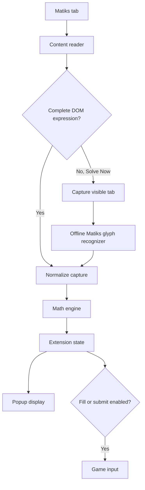

# Matiks Logic Duel Solver V1

A dependency-free Chrome Manifest V3 extension that reads supported Matiks Logic Duel and Sprint arithmetic puzzles, calculates an answer locally, and can place the answer into the game input.

The project combines several puzzle-reading strategies because Matiks does not render every game mode in the same way:

- DOM text and token extraction
- Spatial reconstruction of horizontally or vertically separated tokens
- KaTeX and SVG handling for powers and roots
- A local screenshot fallback for visually rendered Sprint arithmetic
- A deterministic JavaScript math engine
- Optional answer filling and submission

> [!IMPORTANT]
> Use this project only where automation is permitted. Automated play may violate a game, classroom, tournament, or platform's rules. The maintainers are not affiliated with Matiks and do not encourage unfair competitive use.

## Table of contents

- [Features](#features)
- [Supported puzzles](#supported-puzzles)
- [How the extension works](#how-the-extension-works)
- [Project structure](#project-structure)
- [Requirements](#requirements)
- [Installation](#installation)
- [Using the extension](#using-the-extension)
- [Reading strategies](#reading-strategies)
- [Offline visual recognition](#offline-visual-recognition)
- [Math engine](#math-engine)
- [Extension architecture](#extension-architecture)
- [Permissions](#permissions)
- [Stored data](#stored-data)
- [Safety and validation](#safety-and-validation)
- [Development](#development)
- [Testing](#testing)
- [Troubleshooting](#troubleshooting)
- [Known limitations](#known-limitations)
- [Privacy and security](#privacy-and-security)
- [Publishing on GitHub](#publishing-on-github)
- [Contributing](#contributing)
- [Roadmap](#roadmap)

## Features

- Runs as an unpacked Chrome Manifest V3 extension.
- Supports both `https://matiks.com/*` and `https://www.matiks.com/*`.
- Injects the reader into the top page and matching child frames.
- Reads ordinary DOM text, nested text, SVG text, CSS-generated symbols, and selected semantic attributes.
- Reconstructs expressions whose tokens are split across multiple elements.
- Reconstructs vertically stacked Sprint arithmetic.
- Recognizes two to five visual arithmetic terms.
- Solves common Logic Duel modes locally.
- Shows the detected mode, expression, and answer in the popup.
- Supports manual fill and optional submission.
- Stores preferences and the latest result in `chrome.storage.local`.
- Uses no build system, package manager, server, or runtime dependency.
- Performs visual recognition locally and does not upload screenshots.

## Supported puzzles

| Puzzle type | Example input | Example answer |
| --- | --- | --- |
| Addition | `4 + 6` | `10` |
| Subtraction | `9 - 6` | `3` |
| Multiplication | `4 × 4` | `16` |
| Division | `20 ÷ 5` | `4` |
| Multi-term arithmetic | `4 + 6 + 3` | `13` |
| Mixed arithmetic | `2 + 3 × 4` | `14` |
| Remainder / MOD | `96 % 5` | `1` |
| Powers | `4 ^ 3` | `64` |
| Square roots | `√[2] 625` | `25` |
| Cube/indexed roots | `√[3] 27` | `3` |
| HCF / GCD | `12 18` | `6` |
| LCM | `6 8` | `24` |
| Prime factorization | `20` | `2 2 5` |
| Sum of squares | `13` | `3 2` |

Arithmetic chains use normal operator precedence. Multiplication and division are calculated before addition and subtraction.

Visual Sprint recognition currently supports the digit glyphs `0–9` and the operators `+`, `-`, `×`, and `÷`.

## How the extension works



The extension follows these main steps:

1. The popup asks the background service worker to scan the active Matiks tab.
2. The service worker contacts every reachable Matiks frame.
3. Each content script searches for a complete puzzle expression.
4. If no DOM expression is available during a manual scan, the service worker captures the visible tab.
5. The content script examines only the central puzzle region and recognizes Matiks glyphs using local templates.
6. The normalized expression is passed to `solver.js`.
7. The result is saved and displayed in the popup.
8. Depending on the selected controls, the result can be filled or submitted.

## Project structure

```text
LogicDuelFastestSolver/
├── manifest.json          Chrome Manifest V3 configuration
├── background.js          Service worker and message orchestration
├── content.js             DOM reader, visual reader, and input filler
├── solver.js              Deterministic puzzle-solving engine
├── state.js               State creation and capture normalization
├── glyph-templates.js     Offline Matiks digit/operator templates
├── popup.html             Extension popup markup
├── popup.css              Popup styling
├── popup.js               Popup controls and state updates
├── icons/
│   ├── icon16.png
│   ├── icon48.png
│   └── icon128.png
└── README.md
```

There are no generated bundles and no `node_modules` directory. Chrome loads these files directly.

## Requirements

- Google Chrome 116 or newer
- A desktop browser window with a visible Matiks game
- Developer mode enabled on `chrome://extensions/`
- A viewport and zoom level close to the layout used by the included visual templates

The extension is written for Chromium extension APIs. Firefox is not currently supported.

## Installation

### 1. Download the project

Clone the repository:

```bash
git clone https://github.com/YOUR_USERNAME/YOUR_REPOSITORY.git
```

Or download the repository as a ZIP and extract it.

### 2. Load it into Chrome

1. Open `chrome://extensions/`.
2. Enable **Developer mode**.
3. Select **Load unpacked**.
4. Choose the project folder containing `manifest.json`.
5. Pin **Logic Duel Solver V1** from Chrome's Extensions menu.

### 3. Open Matiks

Open a supported page on either:

- `https://matiks.com/`
- `https://www.matiks.com/`

After changing extension source files, reload the extension on `chrome://extensions/` and refresh or reopen the Matiks tab.

If `manifest.json` changes, close existing Matiks tabs and open a new one so Chrome injects the new content-script configuration.

## Using the extension

### Recommended first test

1. Keep **Auto Solver Mode** off.
2. Keep **Auto Filler & Submit** off.
3. Open a visible puzzle.
4. Click **Solve Now**.
5. Confirm that the popup expression exactly matches the screen.
6. Confirm the calculated answer.
7. Click **Fill Answer** if the result is correct.

This verification-first workflow prevents a misread expression from being submitted.

### Popup controls

#### Solve Now

Reads the current puzzle and calculates it immediately.

- With **Auto Filler & Submit** off, it scans and displays the result.
- With **Auto Filler & Submit** on, it scans, validates, fills, and attempts to submit.

#### Fill Answer

Places the currently displayed answer into the visible Matiks answer field. It does not intentionally submit the answer.

#### Auto Solver Mode

Watches DOM mutations for new DOM-readable puzzles and fills validated answers. This mode works best with Logic Duel layouts that expose their puzzle through page elements.

The visual screenshot fallback is currently initiated by **Solve Now**. Fully unattended visual Sprint scanning is not yet implemented.

#### Auto Filler & Submit

Allows a validated **Solve Now** result to be filled and submitted automatically. Keep it disabled until detection has been verified on the current Matiks layout.

## Reading strategies

Matiks has used several rendering styles, so `content.js` uses layered detection.

### Direct expressions

The reader recognizes complete expressions already contained in one element, for example:

```text
96 % 5
```

### Visual token grouping

Numbers and operators may be separate sibling elements. Their bounding rectangles are grouped by visual line and ordered from left to right.

### Stacked arithmetic

Sprint arithmetic may be displayed as:

```text
20
÷ 5
```

The reader combines vertically adjacent rows into `20 ÷ 5`.

For visual screenshot recognition, additional rows are combined into chains such as:

```text
4
+ 6
+ 3
```

which becomes `4 + 6 + 3`.

### Text-node measurement

When wrapper elements do not expose useful direct text, the extension walks raw text nodes and measures their browser `Range` rectangles.

### Semantic metadata

The reader checks selected attributes such as:

- `aria-label`
- `alt`
- `title`
- `data-value`
- `data-expression`
- `data-symbol`

### KaTeX and SVG

Special handling normalizes KaTeX powers and genuine radical elements. Generic decorative SVG files are not treated as roots.

### Frame scanning

The service worker enumerates Matiks frames, asks each reachable content script for a capture, and remembers which frame supplied the selected expression. Answer filling is then directed back to that frame.

## Offline visual recognition

Some Sprint layouts paint visible characters without exposing readable text to the DOM. For these cases, a manual scan uses `chrome.tabs.captureVisibleTab()`.

The screenshot is processed entirely in memory:

1. Crop analysis is restricted to the center of the game board.
2. Bright, low-saturation pixels are treated as candidate white glyph pixels.
3. Horizontal pixel groups identify expression rows.
4. Vertical pixel groups identify characters within each row.
5. Each character is normalized to a `16 × 20` binary mask.
6. The mask is compared against templates in `glyph-templates.js`.
7. A result is accepted only when it forms a complete arithmetic expression.

The templates were generated from real Matiks screenshots for:

- Digits `0–9`
- Addition `+`
- Subtraction `-`
- Multiplication `×`
- Division `÷`

This is not a general-purpose OCR engine. It is intentionally narrow so unrelated names, scores, timers, IDs, and page text are less likely to be interpreted as a puzzle.

## Math engine

`solver.js` exports:

```js
solvePuzzle(mode, rawValue)
```

The function returns an object such as:

```js
{
  answer: "13",
  details: "4 + 6 + 3 = 13",
  kind: "arithmetic",
  confidence: "high"
}
```

### Arithmetic normalization

The engine normalizes equivalent symbols:

- `−` becomes `-`
- `x` and `×` become `*` internally
- `÷` becomes `/` internally

It tokenizes the expression without using `eval()`.

### Operator precedence

For a mixed expression such as:

```text
2 + 3 × 4
```

the multiplication is performed first, producing `14`.

### Other algorithms

- HCF/GCD uses the Euclidean algorithm.
- LCM is calculated from GCD.
- Prime factors use trial division.
- Sum of squares first searches for two positive square terms and then performs a bounded recursive search.
- Roots test exact square, cube, and indexed-root candidates before returning an approximate rounded value where applicable.

## Extension architecture

### `popup.js`

- Loads the latest state.
- Handles Solve, Fill, Auto Solver, and Auto Submit controls.
- Sends messages to the service worker.
- Updates the popup when the service worker publishes new state.

### `background.js`

- Resolves the active tab.
- Validates that the tab belongs to Matiks.
- Enumerates frames with `chrome.webNavigation`.
- Coordinates DOM and visual scans.
- Captures the visible tab for the local visual fallback.
- Calls the solver through state normalization.
- Applies automatic-solution safety rules.
- Routes answers back to the frame that supplied the puzzle.

### `content.js`

- Extracts and ranks puzzle candidates.
- Observes page changes.
- Runs the local visual recognizer.
- Locates answer fields.
- Sets native input values and dispatches input/change events.
- Optionally dispatches Enter keyboard events.

### `state.js`

- Creates the initial state.
- Sanitizes captures.
- Calls the solver.
- Preserves relevant preferences between captures.

### `glyph-templates.js`

Contains binary masks for the Matiks Sprint glyph set. It is loaded before `content.js` so visual scans can access the templates without fetching any external resource.

## Permissions

The extension requests these permissions:

| Permission | Why it is needed |
| --- | --- |
| `activeTab` | Access and capture the Matiks tab after the user invokes the extension |
| `scripting` | Inject the content reader when a page was opened before the extension loaded |
| `storage` | Save the latest capture and popup preferences |
| `webNavigation` | Enumerate frames and find the frame containing the game |
| `https://matiks.com/*` | Run on Matiks without `www` |
| `https://www.matiks.com/*` | Run on the `www` Matiks host |

The project does not request access to every website.

## Stored data

State is stored under `logicDuelSolverState` in `chrome.storage.local`.

A typical state resembles:

```js
{
  mode: null,
  value: "4 + 6 + 3",
  rawText: "4 + 6 + 3",
  source: "visual",
  autoWatch: false,
  solution: {
    answer: "13",
    details: "4 + 6 + 3 = 13",
    kind: "arithmetic",
    confidence: "high"
  },
  status: "Solved: 13",
  updatedAt: 1787870000000
}
```

The `autoFillSubmitEnabled` key stores the submission-toggle preference.

Reloading an updated extension clears stale captures and turns automatic submission off as a safety measure.

## Safety and validation

The project contains several safeguards added after testing different Matiks layouts:

- Arithmetic must match a complete expression pattern.
- Generic single-number captures are not automatically submitted.
- Visual recognition is limited to the central board.
- Scores, timers, countdowns, player names, and decorative images are excluded from visual candidates.
- DOM auto-watch waits for two identical captures separated by a short delay.
- Rapid duplicate automatic submissions are suppressed.
- Root detection requires a genuine radical element or label.
- Visual glyphs must be close enough to known templates.
- A manual submit attempt is rejected when the solution is incomplete or unsafe.
- Remote page/network payloads are not used as puzzle sources.

Always compare the popup expression with the visible puzzle before enabling submission.

## Development

No compilation step is required. Edit the source files and reload the unpacked extension.

Recommended development cycle:

1. Make one focused change.
2. Run syntax checks.
3. Reload the extension.
4. Close and reopen Matiks if the manifest changed.
5. Test with both automation toggles off.
6. Confirm the detected expression and answer.
7. Test filling separately from submission.

### Syntax checks

With Node.js installed:

```bash
node --experimental-default-type=module --check content.js
node --experimental-default-type=module --check background.js
node --experimental-default-type=module --check state.js
node --experimental-default-type=module --check solver.js
node --experimental-default-type=module --check glyph-templates.js
node -e "JSON.parse(require('fs').readFileSync('manifest.json', 'utf8')); console.log('manifest valid')"
```

### Solver smoke test

```bash
node --experimental-default-type=module -e "
import('./solver.js').then(({ solvePuzzle }) => {
  const result = solvePuzzle(null, '4 + 6 + 3');
  console.log(result);
});
"
```

Expected answer:

```text
13
```

## Testing

At minimum, test the following cases after changes:

| Category | Test input |
| --- | --- |
| Binary arithmetic | `4 + 6` |
| Subtraction | `6 - 5` |
| Multiplication | `4 × 4` |
| Division | `20 ÷ 5` |
| Multi-term | `4 + 6 + 3` |
| Mixed precedence | `2 + 3 × 4` |
| MOD | `96 % 5` |
| Root | `√[2] 625` |
| Frame scan | A game embedded in a matching child frame |
| Safety | A countdown screen with scores and timer digits |
| Duplicate prevention | Repeated DOM mutations without a new puzzle |

For visual tests, keep Chrome zoom and display scaling consistent. Verify every recognized expression in the popup before checking the calculated answer.

## Troubleshooting

### The popup says “Open a Logic Duel game on Matiks first”

- Ensure the active tab is on `matiks.com` or `www.matiks.com`.
- Reload the extension and refresh the page.

### The popup says “No puzzle yet”

- Wait until the complete puzzle is visible.
- Click **Solve Now** to trigger the screenshot fallback.
- Make sure the browser tab is visible and not covered by another window.
- Reset Chrome zoom to 100%.

### Visual recognition cannot locate both rows

- Keep the puzzle near the center of the normal Matiks layout.
- Use 100% browser zoom.
- Avoid browser themes or injected styles that change the puzzle font/color.
- Confirm that the expression uses supported white Matiks glyphs.

### Visual recognition is incomplete

The error may show recognized fragments such as:

```text
Offline visual recognition was incomplete (4 / ?6)
```

This means at least one character did not match the bundled templates closely enough. Capture a clean screenshot of the puzzle before modifying templates.

### The answer is displayed but not filled

- Confirm a visible input or textarea exists.
- Click directly in the Matiks answer field once.
- Try **Fill Answer** again.
- Matiks may have changed its input component.

### The answer is filled but not submitted

Synthetic Enter events are not guaranteed to be accepted by every page implementation. Submit manually or update `setInputValue()` for the current Matiks form behavior.

### Auto Solver Mode does not recognize visual Sprint questions

Auto Solver Mode is event-driven and primarily supports DOM-readable puzzles. Use **Solve Now** for the offline screenshot recognizer. Continuous screenshot polling is intentionally not included because it is expensive and increases the risk of reading transition frames.

### Changes do not appear

1. Open `chrome://extensions/`.
2. Press **Reload** on the extension card.
3. Close the Matiks tab.
4. Open a new Matiks tab.

## Known limitations

- Matiks can change its DOM, frame structure, font, colors, spacing, and animations at any time.
- Visual recognition is specialized for the current Matiks desktop design.
- Browser zoom, device pixel ratio, display scaling, or layout changes can reduce template accuracy.
- Visual recognition supports arithmetic glyphs, not every Logic Duel root/factor layout.
- Fully automatic visual Sprint polling is not implemented.
- Synthetic input and Enter events may stop working after a Matiks UI update.
- Approximate root fallback behavior may not match every game rule.
- The extension has no automated browser integration test suite.
- Chrome Web Store packaging and review requirements have not been completed.

## Privacy and security

- Puzzle solving occurs locally in the browser.
- Screenshot data is kept in memory for the current scan.
- Screenshots are not written to disk by the extension.
- Screenshots and puzzle content are not uploaded by this project.
- The extension does not intercept Matiks WebSocket or fetch traffic.
- The project contains no remote JavaScript and no analytics.
- The project does not request access to unrelated websites.

Review the source before installing any browser extension, including this one.

## Publishing on GitHub

Before publishing:

1. Replace `YOUR_USERNAME/YOUR_REPOSITORY` in the clone example.
2. Choose and add a license, such as MIT, Apache-2.0, or GPL-3.0.
3. Add a `.gitignore` if development tools later generate temporary files.
4. Confirm the repository contains no personal screenshots, credentials, cookies, exported browser data, or private Matiks identifiers.
5. Add screenshots only if they do not expose player identities or private match information.
6. Test a fresh clone by loading it as an unpacked extension.
7. Document any Matiks layout/version assumptions in the release notes.

Example Git commands for a new repository:

```bash
git init
git add .
git commit -m "Initial release of Matiks Logic Duel Solver"
git branch -M main
git remote add origin https://github.com/YOUR_USERNAME/YOUR_REPOSITORY.git
git push -u origin main
```

No license is included by default. Without a license, other people generally do not receive permission to copy, modify, or redistribute the code. Add a suitable `LICENSE` file before inviting reuse.

## Contributing

Contributions should be small, testable, and focused.

When reporting a detection problem, include:

- Puzzle type
- Expected expression
- Expression shown in the popup
- Browser version
- Browser zoom
- Display scaling
- Whether the puzzle was DOM-read or visually recognized
- A cropped screenshot with personal information removed

When adding a visual glyph template:

1. Use a clean screenshot at the supported zoom.
2. Crop only the central expression.
3. Preserve the existing `16 × 20` binary-mask format.
4. Test the new glyph against all existing digits/operators to avoid regressions.
5. Keep the confidence threshold conservative.

## Roadmap

Potential future improvements:

- Automated unit tests for all solver modes
- Fixture-based visual recognition tests
- Support for additional Matiks visual fonts and display scales
- Multiple template variants per glyph
- Confidence and source details in the popup
- Safer form-level submission detection
- Optional continuous visual scanning with transition detection
- Chrome Web Store-ready packaging
- A documented template-generation utility

## Disclaimer

This is an independent educational project. It is not endorsed by, sponsored by, or affiliated with Matiks. Matiks names and visual references belong to their respective owners.
# Matiks_duel_solver

